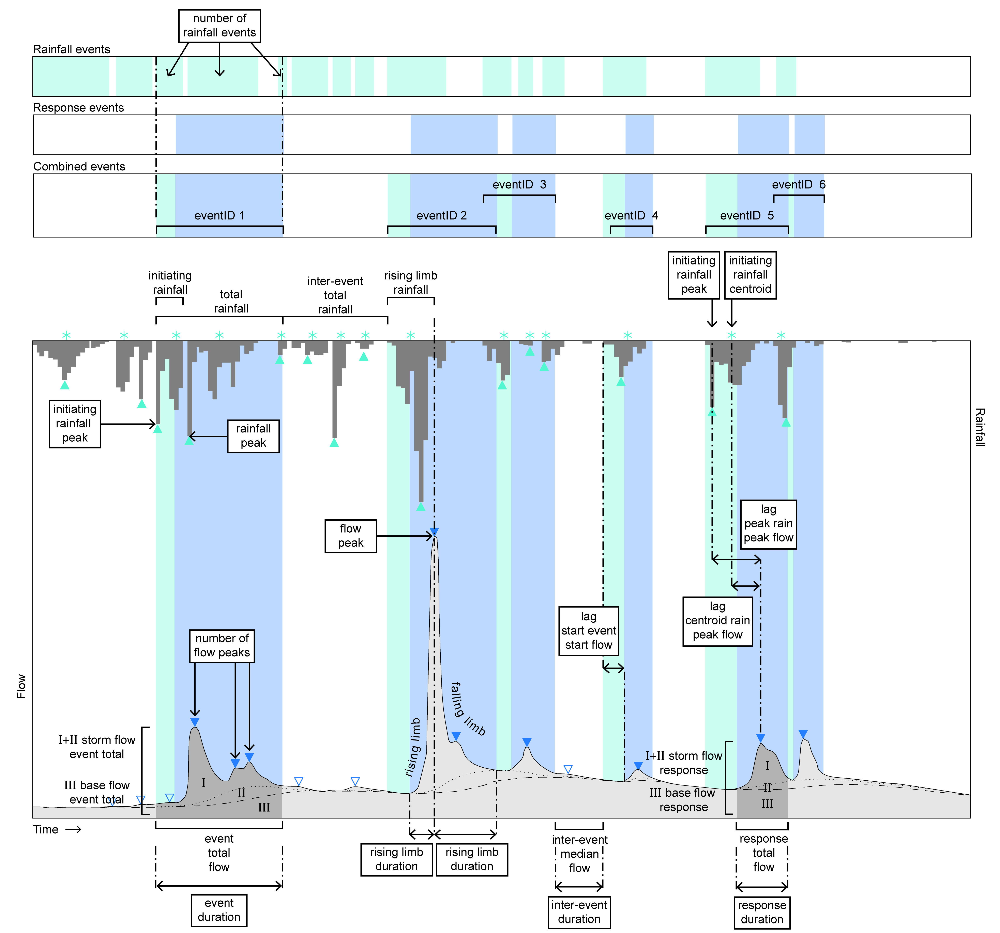

# Hydrological Event Extraction

### Let's update this README with some useful info on how to use this tool when  someone has time ;)

Event Extraction Module written by Josie Ashe.

Short instructions for use:

### Edits should only be required in EventEx_00_RUN.R 

* from lines 41-130 there are some required user inputs - check and edit these as required.

* New functions have been added for reading data in section 1.0 (lines 115-130) which give the user some more control on automating file reads in correct format. Simply add the names of the columns in your dataframe and the correct lubridate time stamp. Be carefule here - this must match exactly what is currently in your dataframe - for example, 31/01/2020 12:00 would be dmy_hm and 31/01/2020 12:00:00 is dmy_hms, likeiwsie if your format is 2020/01/31 12:00:00 the format ymd_hms is required. 

Add relevant citations here asap...

Here's what can be extracted from this workflow...
 

